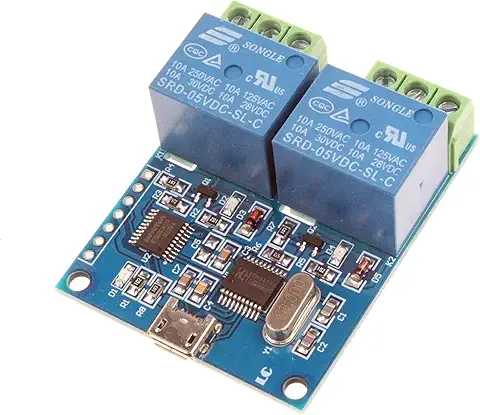
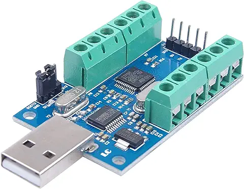

This folder contains source code for controlling and interfacing with Noyito's 2 Channel Relay Module (https://www.amazon.com/s?k=B081RM7PMY) 

And for their 10 channel ADC USB-Serial Module (https://www.amazon.com/s?k=B075GHTCTS).

LabVIEW source code written in LabVIEW 2020 - 32 bit, tested in Windows 10 enviroment.